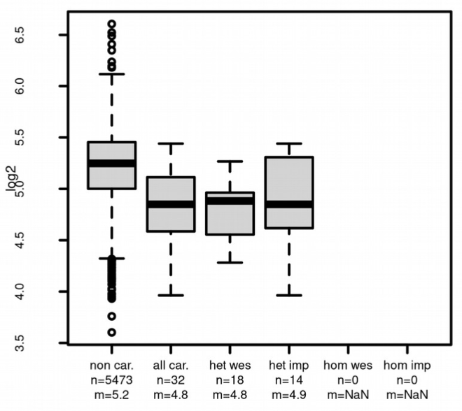
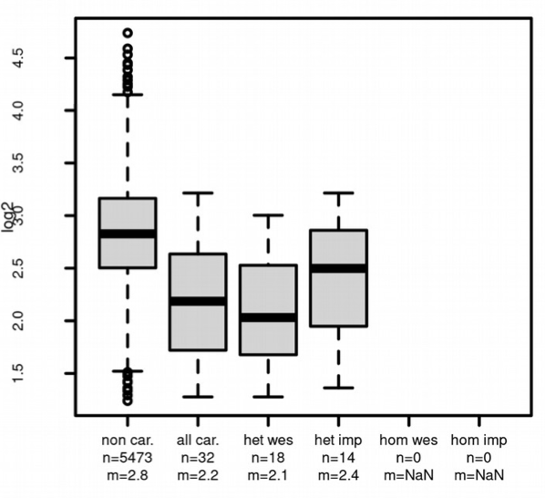
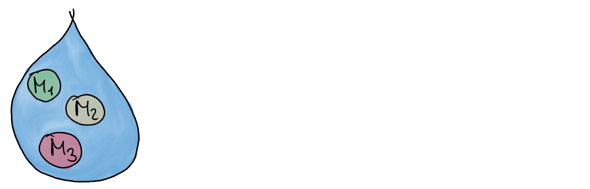

<style type="text/css">

slides > slide:not(.nobackground):after {
  content: '';
}

slides > slide {
    -webkit-transition:none !important;transition:none !important;
}

.build > * {
  -webkit-transition: opacity 0.1s ease-in-out;
  -webkit-transition-delay: 0.1s;
  -moz-transition: opacity 0.1s ease-in-out 0.1s;
  -o-transition: opacity 0.1s ease-in-out 0.1s;
  transition: opacity 0.1s ease-in-out 0.1s;
}

.reveal .slides section .slideContent{
    font-size: 10pt;
}

</style>

<!--
Export to pdf:
webshot function from webshot package.
Might have to change stuff in the style sheet to make it working.
library(webshot)
install_phantomjs()
fn <- paste0("file://", normalizePath("metabolomics.html"))
rmdshot("metabolomics.Rmd", "metabolomics.pdf")
-->

<!--
Use presenter mode: append ?presentme=true to the URL
-->

## Content

- Introduction to metabolomics
- Introduction to (LC-)MS
- Handling and processing metabolomics data in R
- Lab overview: Main preprocessing steps
- Annotation of metabolomics data

<div class="notes">
Here ask first if anyone works in metabolomics ? 
anyone had courses ? metabolomics and MS ? 
</div>

## Metabolite? Metabolism?{.build}

<div style="position:absolute; left:10%; top:13%;">

</div>

<div style="position:absolute; left:30%; top:18%;">

</div>

<div style="position:absolute; left:50%; top:18%;">

</div>
</div>

<div class="notes">
Metabolism: use that word quite freely, we've all discussed something like that
as we gets slower metabolism. But I think other than that, we don't have proper 
image of what it is. So i will give an image of one metabolic pathway.
small examples of where metabolism can be found 
</div>

## Metabolite? Metabolism?

- [Glycolysis](https://en.wikipedia.org/wiki/Glycolysis)

```{r out.width = "800px", echo = FALSE}

```

<div style="font-size: 100%;">
- Key metabolic pathway common to all cells.
- Creates energy by converting glucose to pyruvate.
<div>

<div class="notes">
So if we go in a bit more depth in the glycolysis pathway... important 

The starting product and the end product of the pathway are important but actually what is also very important is all of these analytes generated in between. These analytes are what we call metabolites.
</div>

## Metabolite? Metabolism?

- [Glycolysis](https://en.wikipedia.org/wiki/Glycolysis)

```{r out.width = "800px", echo = FALSE}

```

- Metabolites: intermediates and products of cellular processes.

<div class="notes">
So now i hope you have some kind f image and idea in your mind of what is a metaboic pathway and a metabolite
</div>

## Metabolomics? {.build}

- Large-scale study of small molecules in a system.

<div>
**What** are we measuring? ... depends on context:
</div>
<div>
  - (human) metabolomics: metabolites, lipids, ...
</div>
<div>
  - plant and food metabolomics: metabolites, polyphenoles, ...
</div>
<div>
  - exposomics: chemicals, pharmaceuticals, ...
</div>
<div>
  - environmental sciences: chemicals, metals, ...
</div>

<div>
**How** are we measuring these small compounds?
</div>
<div>
- **Nuclear Magnetic Resonance** (NMR): highly specific, not very sensitive.
- **Mass Spectrometry** (MS): less specific, highly sensitive, high throughput.
</div>

<div class="notes">
exposmics: what individuals are exposed to in their life
</div>

## (*Human*) Metabolomics {.build}

**Where** can we measure small compounds/metabolites?

<div>
- Blood (serum):
  - insights into general physiological state of organism.
  - venous blood/capillary (arterial) blood.
</div>
<div>
- Urine, stool samples, (food, dust): external influence.
</div>
<div>
- Cell culture experiments:
  - supernatant: what did cells consume/produce?
  - cell extracts: insights into mitochondrial metabolism.

<div style="position:absolute; left:10%; top:75%;">

</div>
</div>


## Metabolomics {.build}

### Putting metabolomics into context:
</div>
<div>
  - **Genome**: what can happen.
</div>
<div>
  - **Transcriptome**: what appears to be happening.
</div>
<div>
  - **Proteome**: what makes it happen.
</div>
<div>
  - **Metabolome**: what actually happened.
</div>
<div>
### Properties of the metabolome:
</div>
<div>
- Metabolome is **highly dynamic**.
- Metabolome influenced by **genetic** *and* **environmental factors**.
</div>

<div class="notes">
Throughout this week you've learned about different types of omics that you also are more familiar about. I think it's supoer important to put all of them into contex, as they are actually very complementary. 

The metabolome is the final product of all of these omics. It's the final product of the genome, the transcriptome and the proteome. It's what actually happened. 

If you analyse the blood of a person one hour after eating of 5 hours you will have a very different profile. same if you analyse the blood of a person 1 hour after eating a burger or one hour after eatigna  salad. So it complexify and makes reproducibility very complicated but it is also what makes it so interesting because it's a direct reflection of what is happening in the body.

</div>

## Influence from genetic factors 

- mGWAS: associations between genetic variants and metabolite concentrations.

<div>

</div>

<div style="position:absolute; left:55%; top:25%;">



</div>

<div>
- Significant association between variant and carnitine, acetylcarnitine and
  butyrylcarnitine.
</div>
<div>
- SLC22A5: carnitine transporter.
- Genetic variant in this gene has influence on its function.
</div>


## How can we measure metabolites? {.build}

<div>
- Metabolites small enough to be directly measured by Mass Spectrometry.
- Most metabolites uncharged - need to create ions first.
</div>

<div>
### Two main setups to measure metabolites:
</div>
<div>
  - **targeted**: quantitative measurement of selected metabolites.
</div>
<div>
  - **untargeted**: semi-quantitative measurement of all metabolites (detectable
    with the setup) in a sample.
</div>

<div class="notes">
Targeted mass spectrometry is designed to detect and quantify specific, predefined compounds. In this approach, we focus on monitoring selected ions that correspond to known compounds. This method provides high sensitivity and specificity, making it ideal for applications such as clinical diagnostics, pharmacokinetics, and biomarker validation.

On the other hand, untargeted mass spectrometry aims to profile all detectable compounds within a sample without prior knowledge of their identity. This comprehensive approach allows for the discovery of new compounds and the generation of broad metabolic profiles. It is especially useful in exploratory studies, where the goal is to understand complex biological or chemical systems.
</div>

## Mass Spectrometry (MS)

<div style="position:absolute; top:28%; left:7%; width:400px">
```{r out.width = "400px", echo = FALSE}
knitr::include_graphics("images/MS_ionization_mod.png")
```
</div>

<div class="notes">
describe MS

</div>


## Mass Spectrometry (MS)

<div style="position:absolute; top:28%; left:7%; width:400px">
```{r out.width = "400px", echo = FALSE}
knitr::include_graphics("images/MS_ionization_mod.png")
```
</div>
<div style="position:absolute; top:20%; left:53%; width:300px">
```{r out.width = "300px", echo = FALSE}
knitr::include_graphics("images/Spectrum1_mod.png")
```
</div>

## Mass Spectrometry (MS)

<div style="position:absolute; top:28%; left:7%; width:400px">
```{r out.width = "400px", echo = FALSE}
knitr::include_graphics("images/MS_ionization_mod.png")
```
</div>
<div style="position:absolute; top:13%; left:49%; width:430px">
```{r out.width = "430px", echo = FALSE}

```
</div>

## Mass Spectrometry (MS)

<div style="position:absolute; top:28%; left:7%; width:400px">
```{r out.width = "400px", echo = FALSE}
knitr::include_graphics("images/MS_ionization_mod.png")
```
</div>
<div style="position:absolute; top:13%; left:49%; width:430px">
```{r out.width = "430px", echo = FALSE}

```
</div>

<div style="position:absolute; top:57%; left:10%;">
**Glucose** (C6H12O6)
</div>
<div style="position:absolute; top:63%; left:10%;">
**Fructose** (C6H12O6)
</div>
<div style="position:absolute; top:69%; left:10%;">
**Mannose** (C6H12O6)
</div>

<div style="position:absolute; top:80%;left:7%">
> - **Problem:** unable to distinguish between metabolites with the same/similar 
    mass-to-charge ratio (*m/z*).
> - **Solution:** additional separation of metabolites prior to MS.
</div>


## Mass Spectrometry (MS)

<div style="position:absolute; top:28%; left:7%; width:400px">
```{r out.width = "400px", echo = FALSE}
knitr::include_graphics("images/MS_ionization_mod.png")
```
</div>
<div style="position:absolute; top:13%; left:49%; width:430px">
```{r out.width = "430px", echo = FALSE}

```
</div>

<div style="position:absolute; top:57%; left:10%;">
**Glucose** (C6H12O6)
</div>
<div style="position:absolute; top:54%; left:35%;">
```{r out.width = "80px", echo = FALSE}

```
</div>
<div style="position:absolute; top:63%; left:10%;">
**Fructose** (C6H12O6)
</div>
<div style="position:absolute; top:60%; left:35%;">
```{r out.width = "80px", echo = FALSE}

```
</div>
<div style="position:absolute; top:69%; left:10%;">
**Mannose** (C6H12O6)
</div>
<div style="position:absolute; top:66%; left:35%;">
```{r out.width = "80px", echo = FALSE}

```
</div>

<div style="position:absolute; top:80%;left:7%">
- **Problem:** unable to distinguish between metabolites with the same/similar 
    mass-to-charge ratio (*m/z*).
- **Solution:** additional separation of metabolites prior to MS.
</div>


## Liquid chromatography {.build}

<div>
- Sample is dissolved in a fluid (mobile phase).

<div style="position:absolute; top:60%;left:25%">
```{r out.width = "500px", echo = FALSE}

```
</div>
</div>

## Liquid chromatography

- Sample is dissolved in a fluid (mobile phase).

- Mobile phase carries analytes through column (stationary phase).

<div style="position:absolute; top:60%;left:25%">
```{r out.width = "500px", echo = FALSE}
knitr::include_graphics("images/LC_02.png")
```
</div>


## Liquid chromatography

- Sample is dissolved in a fluid (mobile phase).

- Mobile phase carries analytes through column (stationary phase).

- Separation based on affinity for the column's stationary phase.

<div style="position:absolute; top:60%;left:25%">
```{r out.width = "500px", echo = FALSE}
knitr::include_graphics("images/LC_03.png")
```
</div>


## Liquid chromatography

- Sample is dissolved in a fluid (mobile phase).

- Mobile phase carries analytes through column (stationary phase).

- Separation based on affinity for the column's stationary phase.

- Commonly used:
  [RPLC](https://en.wikipedia.org/wiki/Reversed-phase_chromatography) (Reversed
  Phase LC).
  [HILIC](https://en.wikipedia.org/wiki/Hydrophilic_interaction_chromatography)
  (hyrophilic liquid interaction chromatography)

<div style="position:absolute; top:60%;left:25%">
```{r out.width = "500px", echo = FALSE}
knitr::include_graphics("images/LC_03.png")
```
</div>


<!-- Now comes the incremental LC-MS description -->
## | **Mass Spectrometry (MS)** {.notransition}

```{r out.width = "700px", echo = FALSE}

```

## | **Liquid Chromatography Mass Spectrometry (LC-MS)** {.notransition}

```{r out.width = "700px", echo = FALSE}
knitr::include_graphics("images/LCMS_Spectrum1.png")
```

<div style="position:absolute; left:50%; top:55%">
We gain an additional dimension:

- retention time.
</div>

## | **Liquid Chromatography Mass Spectrometry (LC-MS)** {.notransition}

```{r out.width = "700px", echo = FALSE}
knitr::include_graphics("images/LCMS_Spectrum2.png")
```

<div style="position:absolute; left:50%; top:55%">
We gain an additional dimension:

- retention time.
</div>

## | **Liquid Chromatography Mass Spectrometry (LC-MS)** {.notransition}

```{r out.width = "700px", echo = FALSE}
knitr::include_graphics("images/LCMS_Spectrum3.png")
```

<div style="position:absolute; left:50%; top:55%">
We gain an additional dimension:

- retention time.
</div>

## | **Liquid Chromatography Mass Spectrometry (LC-MS)** {.notransition}

```{r out.width = "700px", echo = FALSE}
knitr::include_graphics("images/LCMS_Spectrum4.png")
```

<div style="position:absolute; left:50%; top:55%">
We gain an additional dimension:

- retention time.
</div>

## | **Liquid Chromatography Mass Spectrometry (LC-MS)** {.notransition}

```{r out.width = "700px", echo = FALSE}

```

<div style="position:absolute; left:50%; top:55%">
We gain an additional dimension:

- retention time.
</div>

## | **Liquid Chromatography Mass Spectrometry (LC-MS)** {.notransition}

```{r out.width = "700px", echo = FALSE}

```

<div style="position:absolute; left:50%; top:55%">
We gain an additional dimension:

- retention time.
</div>

## | **Liquid Chromatography Mass Spectrometry (LC-MS)** {.notransition}

```{r out.width = "700px", echo = FALSE}

```

<div style="position:absolute; left:50%; top:55%">
We gain an additional dimension:

- retention time.
</div>
<div style="position:absolute; left:50%; top:70%">
- LC-MS: analyze data along retention time.
</div>

## | **Liquid Chromatography Mass Spectrometry (LC-MS)** {.notransition}

<div>

</div>


## | **Liquid Chromatography Mass Spectrometry (LC-MS)** {.notransition}

Signal measured along retention time (150-175 seconds).

<div>

</div>


## | **Liquid Chromatography Mass Spectrometry (LC-MS)** {.notransition}

Signal along rt (chromatogram) of an [M+Na]+ ion of *C6H12O6*.

<div>

</div>


## Mass Spectrometry Data in *R*: An overview

<div>
<div style="position:absolute; top:30%;left:5%">

</div>


## Mass Spectrometry Data in *R*{.build}

```{r, echo = FALSE, message = FALSE}
## Run preprocessing on one file
library(Spectra)
library(xcms)
library(MSnbase)
fl <- system.file("mzML", "HighIS_Mix07_CE20_POS.mzML",
                  package = "MetaboAnnotationTutorials")
std_data <- readMSData(fl, mode = "onDisk")
cwp <- CentWaveParam(snthresh = 5, prefilter = c(3, 300), ppm = 40,
                     peakwidth = c(2, 8), integrate = 2)
std_data <- findChromPeaks(std_data, param = cwp)
std_data <- refineChromPeaks(std_data, MergeNeighboringPeaksParam(expandRt = 3))
```

<div>
- Data stored in *mzML* files.
</div>
<div>
- To load such data into *R*:
</div>

<div style="position:absolute; left:45px; top:391px;">

</div>

<div>
<div style="position:absolute; left:115px; top:270px;">

</div>
<div style="position:absolute; left:29%; top:335px;">
`ms <- readMsExperiment(fl)`
</div>
</div>

<div>
<div style="position:absolute; left:115px; top:513px;">

</div>
<div style="position:absolute; left:29%; top:580px;">
`sps <- Spectra(fl, backend = MsBackendMzR())`
</div>


<div class="notes">
To handle MS data in R we use the MsExperiment and Spectra packages. Spectra handle the raw data and MsExperiment is a more high level package that allows to handle the data in a more user friendly way.
</div>


## LC-MS data analysis {.build}

<div>
- Untargeted metabolomics (label-free proteomics).

<div style="position:absolute; left:45px; top:307px;">

</div>

<div style="position:absolute; left:115px; top:185px;">

</div>
</div>
<div>
<div style="position:absolute; left:254px; top:185px;">

</div>
<div style="position:absolute; left:45%; top:250px;">
- LC-MS preprocessing:
</div>
</div>


## LC-MS data analysis {.notransition}

- Untargeted metabolomics (label-free proteomics).

<div style="position:absolute; left:45px; top:307px;">

</div>

<div style="position:absolute; left:115px; top:185px;">

</div>
<div style="position:absolute; left:254px; top:185px;">

</div>
<div style="position:absolute; left:45%; top:250px;">
- LC-MS preprocessing:
  - chromatographic peak detection
</div>

<div style="position:absolute; left:23%; top:375px;">
`findChromPeaks`
</div>

<div style="position:absolute; left:20%; top:55%">

</div>


## LC-MS data analysis {.notransition}

- Untargeted metabolomics (label-free proteomics).

<div style="position:absolute; left:45px; top:307px;">

</div>

<div style="position:absolute; left:115px; top:185px;">

</div>
<div style="position:absolute; left:254px; top:185px;">

</div>
<div style="position:absolute; left:45%; top:250px;">
- LC-MS preprocessing:
  - chromatographic peak detection
  - alignment
</div>

<div style="position:absolute; left:23%; top:375px;">
`adjustRtime`
</div>

<div style="position:absolute; left:20%; top:55%">

</div>

## LC-MS data analysis {.notransition}

<div>
- Untargeted metabolomics (label-free proteomics).

<div style="position:absolute; left:45px; top:307px;">

</div>

<div style="position:absolute; left:115px; top:185px;">

</div>
<div style="position:absolute; left:254px; top:185px;">

</div>
<div style="position:absolute; left:45%; top:250px;">
- LC-MS preprocessing:
  - chromatographic peak detection
  - alignment
  - correspondence
</div>

<div style="position:absolute; left:20%; top:55%">

</div>

<div style="position:absolute; left:23%; top:375px;">
`groupChromPeaks`
</div>


## LC-MS data analysis {.notransition}

<div>
- Untargeted metabolomics (label-free proteomics).

<div style="position:absolute; left:45px; top:307px;">

</div>

<div style="position:absolute; left:115px; top:185px;">

</div>
<div style="position:absolute; left:254px; top:185px;">

</div>
<div style="position:absolute; left:45%; top:250px;">
- LC-MS preprocessing:
  - chromatographic peak detection
  - alignment
  - correspondence
</div>

<div style="position:absolute; left:23%; top:375px;">
`featureValues`
</div>

<div style="position:absolute; left:15%; top:60%; font-size:50%;">
```{r, echo = FALSE, message = FALSE}
npks <- nrow(chromPeaks(std_data))
fts <- DataFrame(
    mz = chromPeaks(std_data)[, "mz"],
    rt = chromPeaks(std_data)[, "rt"],
    sample_1 = chromPeaks(std_data)[, "into"],
    sample_2 = abs(chromPeaks(std_data)[, "into"] + rnorm(npks, 70, 70)),
    sample_3 = abs(chromPeaks(std_data)[, "into"] + rnorm(npks, 40, 70)),
    sample_4 = abs(chromPeaks(std_data)[, "into"] + rnorm(npks, 90, 70)))
rownames(fts) <- sub("CP", "FT", rownames(fts))
fts
```
</div>


## LC-MS data analysis

<div style="position:absolute; top:250px;">
- Data exploration
- Data normalization
- Differential abundance analysis

R is a amazing tool for this kind of statistical analysis.
</div>

## But wait - what are we actually measuring?{.build}


- *LC-MS features* characterized by their *m/z* and retention time.
- **Goal**: *annotate* these features to metabolites (compounds).

<div style="position:absolute; left:15%; top:40%; font-size:50%;">
```{r, echo = FALSE, message = FALSE}
fts
```
</div>


## One step back: ionization {.build}

```{r, echo = FALSE, results = "asis"}
library(MetaboCoreUtils)
library(pander)
cmps <- data.frame(name = c("Caffeine", "Enprofylline"),
                   formula = c("C8H10N4O2", "C8H10N4O2"))
cmps$exactmass <- calculateMass(cmps$formula)

cmps <- cbind(cmps, mass2mz(cmps$exactmass, adduct = c("[M+H]+", "[M+Na]+")))

pandoc.table(cmps[1, 1:3], style = "rmarkdown")
```

<div style="position:absolute; left:5%; top:40%">
- Molecule not charged. Can not be detected with MS.
</div>

## One step back: ionization {.notransition}

```{r, echo = FALSE, results = "asis"}
pandoc.table(cmps[1, 1:4], style = "rmarkdown")
```

<div style="position:absolute; left:5%; top:40%">
- Molecule not charged. Can not be detected with MS.
- Electro spray ionization: create ions
</div>

## One step back: ionization {.notransition}

```{r, echo = FALSE, results = "asis"}
pandoc.table(cmps[1, ], style = "rmarkdown")
```

<div style="position:absolute; left:5%; top:40%">
- Molecule not charged. Can not be detected with MS.
- Electro spray ionization: create ions, potentially multiple.
</div>

## Annotation: using *m/z* values {.notransition}

```{r, echo = FALSE, results = "asis"}
pandoc.table(cmps[1, ], style = "rmarkdown")
```

<div style="position:absolute; left:5%; top:40%">
- Molecule not charged. Can not be detected with MS.
- Electro spray ionization: create ions, potentially multiple.
- Match measured *m/z* against these reference values.
</div>

<div style="position:absolute; left:50px; top:450px;">

</div>
<div style="position:absolute; left:25%; top:492px;">
```{r, eval = FALSE}
mtch <- matchValues(query, target,
                    Mass2MzParam(c("[M+H]+", "[M+Na]+")))
```
</div>


## Annotation: using *m/z* values {.notransition}

```{r, echo = FALSE, results = "asis"}
pandoc.table(cmps[1, ], style = "rmarkdown")
```

<div style="position:absolute; left:5%; top:40%">
- Molecule not charged. Can not be detected with MS.
- Electro spray ionization: create ions, potentially multiple.
- Match measured *m/z* against these reference values.
</div>

<div style="position:absolute; left:50px; top:450px;">

</div>
<div style="position:absolute; left:25%; top:492px;">
```{r, eval = FALSE}
mtch <- matchValues(query, target,
                    Mass2MzParam(c("[M+H]+", "[M+Na]+")))
```
</div>

<div style="position:absolute; left:5%; top:84%;">
- `query`: experimental *m/z* values.
- `target`: reference masses (e.g. from *HMDB*, *ChEBI*, *PubChem*, ...).
</div>

## A little additional complication {.build}

<div>
```{r, echo = FALSE, results = "asis"}
pandoc.table(cmps, style = "rmarkdown")
```
</div>
<div style="position:absolute; left:5%; top:50%">
- Enprofylline: asthma treatment agent.
- Compounds can have same formula - how to distinguish?
</div>


## A little additional complication {.notransition}

```{r, echo = FALSE, results = "asis"}
pandoc.table(cmps, style = "rmarkdown")
```
<div style="position:absolute; left:5%; top:50%">
- Enprofylline: asthma treatment agent.
- Compounds can have same formula - how to distinguish?
- They differ by their structure. Thus will separate in the LC: 
                -> different retention time.
</div>

<div style="position:absolute; left:150px; top:550px">

</div>

<div style="position:absolute; left:500px; top:550px">

</div>


## Annotation: using *m/z* **and** retention time {.build}

- Annotation using *m/z* and retention time:

<div>
<div style="position:absolute; left:50px; top:400px;">

</div>
<div style="position:absolute; left:25%; top:443px;">
```{r, eval = FALSE}
mtch <- matchValues(query, target,
                    Mass2MzRtParam(c("[M+H]+", "[M+Na]+")))
```
</div>
</div>

- Requires that we do have **reference** retention times available.
- These are instrument set-up/lab-specific.


## Annotation: using MS2 spectra {.build}

<div>
- We can *fragment* ions to get some information on their structure.
</div>
<div>

</div>


## Annotation: using MS2 spectra

<div>
- We can *fragment* ions to get some information on their structure.
</div>

<div>

</div>

<div>
- LC-MS/MS data: MS1 for quantification, MS2 for annotation.
</div>


## Annotation: using MS2 spectra {.build}

- If we have MS2 spectra associated to features, we can match them against
  *reference* spectra.
- Calculate similarity scores and compare spectra.

<div style="float:left;">

</div>
<div style="float:left;">

</div>


## Annotation: using MS2 spectra{.build}

- If we have MS2 spectra associated to features, we can match them against
  *reference* spectra.
- Calculate similarity scores and compare spectra.

<div style="position:absolute; left:50px; top:290px;">

</div>

<div style="position:absolute; left:25%; top:333px;">
```{r, eval = FALSE}
mtch <- matchSpectra(query, target,
                     CompareSpectraParam())
```
</div>
</div>

<div style="position:absolute; left:50px; top:580px;">
- **Limitation**: availability of reference spectra.
- Public reference databases are growing, collecting data shared by researchers.
</div>

## Workshops {.build}

<div>
<div style="position:absolute; left:70px; top:130px;">

</div>
<div style="position:absolute; left:25%; top:179px;">
[`xcmsTutorials`](https://github.com/jorainer/xcmsTutorials): 
exploring and analyzing LC-MS using *Spectra* and *xcms* (updated workflow with
upcoming version of *xcms*).
</div>
</div>

<div>
<div style="position:absolute; left:70px; top:300px;">

</div>
<div style="position:absolute; left:25%; top:352px;">
[`SpectraTutorials`](https://github.com/jorainer/SpectraTutorials): 
introduction to MS data handling and processing using *Spectra*.
</div>
</div>

<div>
<div style="position:absolute; left:70px; top:470px;">

</div>
<div style="position:absolute; left:25%; top:522px;">
[`MetaboAnnotationTutorials`](https://github.com/jorainer/MetaboAnnotationTutorials): 
annotation of untargeted metabolomics data.
</div>
</div>

<div style="position:absolute; left:70px; top:650px;">
[End-to-end workflow for LC-MS/MS analysis (still work in progess)](https://github.com/EuracBiomedicalResearch/end-to-end-untargeted-metabolomics)


<div class="notes">
describe the dataset for the tutorials.
</div>

## 

<div style="position:absolute; top:48%; left:33%;">
**Thank you for your attention**
</div>
